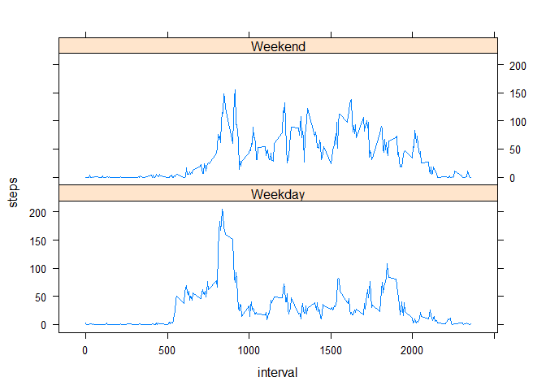

```r
knitr:: opts_chunk$set(echo = TRUE, results = 'asis')
```

### This is a data exploration of activity monitoring. We do this by answering some questions about the data.


## Loading and preprocessing the data

We first unzip that data and read into r with the code below.

```r
unzip("activity.zip")
activity = read.csv("activity.csv")
```

We will name the dataset 'activity'. A snapshot of the dataset is shown below:

```r
library(xtable)
print(xtable(activity[8000:8010,]), type = "html")
```

<!-- html table generated in R 3.6.2 by xtable 1.8-4 package -->
<!-- Wed Dec 16 10:32:25 2020 -->
<table border=1>
<tr> <th>  </th> <th> steps </th> <th> date </th> <th> interval </th>  </tr>
  <tr> <td align="right"> 8000 </td> <td align="right">   5 </td> <td> 2012-10-28 </td> <td align="right"> 1835 </td> </tr>
  <tr> <td align="right"> 8001 </td> <td align="right">   0 </td> <td> 2012-10-28 </td> <td align="right"> 1840 </td> </tr>
  <tr> <td align="right"> 8002 </td> <td align="right">  76 </td> <td> 2012-10-28 </td> <td align="right"> 1845 </td> </tr>
  <tr> <td align="right"> 8003 </td> <td align="right">   8 </td> <td> 2012-10-28 </td> <td align="right"> 1850 </td> </tr>
  <tr> <td align="right"> 8004 </td> <td align="right">  91 </td> <td> 2012-10-28 </td> <td align="right"> 1855 </td> </tr>
  <tr> <td align="right"> 8005 </td> <td align="right">  21 </td> <td> 2012-10-28 </td> <td align="right"> 1900 </td> </tr>
  <tr> <td align="right"> 8006 </td> <td align="right">  24 </td> <td> 2012-10-28 </td> <td align="right"> 1905 </td> </tr>
  <tr> <td align="right"> 8007 </td> <td align="right">  35 </td> <td> 2012-10-28 </td> <td align="right"> 1910 </td> </tr>
  <tr> <td align="right"> 8008 </td> <td align="right"> 135 </td> <td> 2012-10-28 </td> <td align="right"> 1915 </td> </tr>
  <tr> <td align="right"> 8009 </td> <td align="right"> 166 </td> <td> 2012-10-28 </td> <td align="right"> 1920 </td> </tr>
  <tr> <td align="right"> 8010 </td> <td align="right">   0 </td> <td> 2012-10-28 </td> <td align="right"> 1925 </td> </tr>
   </table>


## What is mean total number of steps taken per day?

We can summarize the dataset using the aggregate function (ignoring missing values). 

```r
dailysteps = aggregate(steps ~ date, data = activity, function(x) sum(x, na.rm = TRUE))
```

We can the check the distribution of steps using a histrogram. The central value of histogram is around 10000 to 15000 steps.  

```r
hist(dailysteps$steps, main = "distrubution of total daily steps", 
     xlab = "daily steps")
```

<!-- -->

We can calculate specific central tendencies; mean and median.

```r
Mu = mean(dailysteps$steps, na.rm = TRUE)
Mu
```

[1] 10766.19

```r
Md = median(dailysteps$steps, na.rm = TRUE)
Md
```

[1] 10765


__The mean total number of steps taken per day is 10766 while the median is 10765.__ 

## What is the average daily activity pattern?

To understand the aaverage daily activity pattern, we summarize tha data again, in this case, in terms of the 5-minute interval.

```r
fivemin_steps = aggregate(steps ~ interval, data = activity, function(x) mean(x, na.rm = TRUE))
```

We can plot the steps by interval.

```r
library(ggplot2)
```

```
## Warning: package 'ggplot2' was built under R version 3.6.3
```

```r
p = ggplot(data = fivemin_steps, aes(interval, steps)) + geom_line()
p = p + scale_x_continuous(breaks = seq(0, 2400, by = 200))
p
```

<!-- -->

```r
fivemin_steps[which.max(fivemin_steps$steps),]
```

    interval    steps
104      835 206.1698

__Based from the time series plot above we can see that in general, maximum number of steps is taken between 800 to 1000th minute. More specifically, the interval with the maximum number of steps is 835 with about 206 steps__ (see table below also).


```r
maxstep = fivemin_steps[fivemin_steps$steps>150,]
print(xtable(maxstep), type = "html")
```

<!-- html table generated in R 3.6.2 by xtable 1.8-4 package -->
<!-- Wed Dec 16 10:32:28 2020 -->
<table border=1>
<tr> <th>  </th> <th> interval </th> <th> steps </th>  </tr>
  <tr> <td align="right"> 100 </td> <td align="right"> 815 </td> <td align="right"> 157.53 </td> </tr>
  <tr> <td align="right"> 101 </td> <td align="right"> 820 </td> <td align="right"> 171.15 </td> </tr>
  <tr> <td align="right"> 102 </td> <td align="right"> 825 </td> <td align="right"> 155.40 </td> </tr>
  <tr> <td align="right"> 103 </td> <td align="right"> 830 </td> <td align="right"> 177.30 </td> </tr>
  <tr> <td align="right"> 104 </td> <td align="right"> 835 </td> <td align="right"> 206.17 </td> </tr>
  <tr> <td align="right"> 105 </td> <td align="right"> 840 </td> <td align="right"> 195.92 </td> </tr>
  <tr> <td align="right"> 106 </td> <td align="right"> 845 </td> <td align="right"> 179.57 </td> </tr>
  <tr> <td align="right"> 107 </td> <td align="right"> 850 </td> <td align="right"> 183.40 </td> </tr>
  <tr> <td align="right"> 108 </td> <td align="right"> 855 </td> <td align="right"> 167.02 </td> </tr>
   </table>

## Imputing missing values

Previously we ignore the missing values and in this part we will impute them. We first count how many missing values are there.

```r
miss = sum(is.na(activity))
miss
```

[1] 2304
__There are 2304 missing values.__ 

We will use the median in place of the missing value. The code below uses the dplyr package to impute missing data. First,  it groups the data by the interval. It then checks if the steps are recored or it is a missing value. Finally, it replace the missing value with the median of the particular interval.


```r
library(dplyr)
```

```
## Warning: package 'dplyr' was built under R version 3.6.3
```

```
## 
## Attaching package: 'dplyr'
```

```
## The following objects are masked from 'package:stats':
## 
##     filter, lag
```

```
## The following objects are masked from 'package:base':
## 
##     intersect, setdiff, setequal, union
```

```r
activity2 = activity %>% group_by(interval) %>% 
        mutate(steps = ifelse(is.na(steps), median(steps, na.rm = TRUE),
                                                            steps))
```

We can check the missing value of the imputed dataset, named, "activity2".

```r
sum(is.na(activity2))
```

[1] 0

Now that there are no missing value, we can check the distribution of the new dataset.

```r
dailysteps2 = aggregate(steps ~ date, data = activity2, 
                        function(x) sum(x,na.rm = TRUE)) 

hist(dailysteps2$steps, main = "distrubution of total daily steps", 
     xlab = "daily steps")
```

<!-- -->

We can compare the old and the new dataset.

```r
par(mfrow = c(1,2))

hist(dailysteps$steps, main = "distrubution of total daily steps
     \n (original)", 
     xlab = "daily steps")

hist(dailysteps2$steps, main = "distrubution of total daily steps 
     \n (imputed)", 
     xlab = "daily steps")

par(mfrow = c(1,1))
```


In the imputed dataset, there is an increase in the frequency of the 0-5000 steps.


```r
Mu2 = mean(dailysteps2$steps)
Mu2
```

[1] 9503.869

```r
Md2 = median(dailysteps2$steps)
Md2
```

[1] 10395

__The mean total number of steps taken per day in the new dataset is is 9503 while the median is 10395. These values were lower than previously reported above.__ 


## Are there differences in activity patterns between weekdays and weekends?

To understand this question we add a new column that indicates dates if they are weekdays or weekends (i.e Saturday and Sunday). We use the timeDate package for this.


```r
library(timeDate)
```

```
## 
## Attaching package: 'timeDate'
```

```
## The following object is masked from 'package:xtable':
## 
##     align
```

```r
activity2$week = ifelse(isWeekday(activity2$date), "Weekday", "Weekend")

weeksteps = aggregate(steps ~ interval + week, data = activity2, 
                        function(x) mean(x,na.rm = TRUE)) 
```

We can now plot and compare steps in the Weekdays vs the Weekends


```r
library(lattice)
xyplot(steps ~ interval | week, data = weeksteps, type = "l", layout = c(1,2))
```

<!-- -->

Based on the graph above, we can see that more steps are taken across the different five-minute intervals during the Weekends. Whereas during the Weekdays, it is frequent in some periods only such as between the 500 to 1000 interval.
